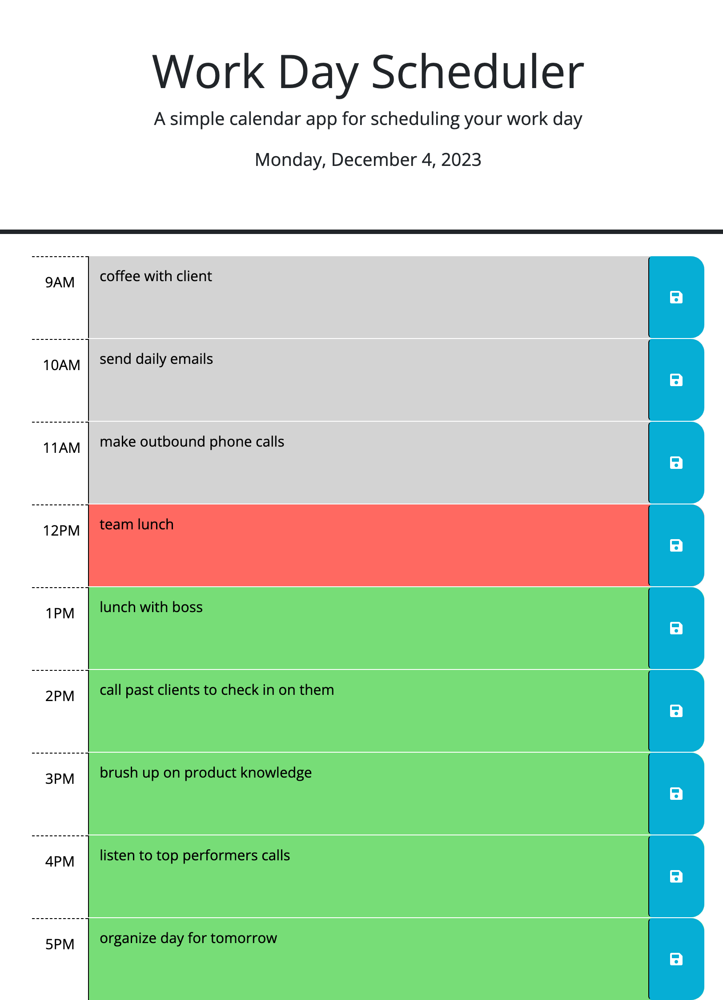

# work-day-planner

## Description

I have created a calendar for your work day! By creating this calendar i learned how to use day.js effectively and how to save something to local storage. Now i have a calendar to use during my day job as a sales rep. This will allow me to stay organized and not forget important tasks. 

## Usage

to use the planner, click this website here: 

the planner is customizable to where you can edit the info for each hour and save your changes to your local machine by clicking the 'save' icon. 

see a screenshot of the planner here: 

## Credits

https://dev.to/t3cstudios/how-to-make-a-save-button-using-javascript-42bc
https://blog.logrocket.com/localstorage-javascript-complete-guide/#:~:text=of%20a%20localStorage-,Storing%20data%20with%20setItem(),the%20value%20attached%20to%20it.
https://www.geeksforgeeks.org/how-to-design-a-simple-calendar-using-javascript/
https://mirzaleka.medium.com/the-complete-guide-to-day-js-fb835a5d945a
https://day.js.org/docs/en/display/format
https://coding-boot-camp.github.io/full-stack/github/professional-readme-guide/
